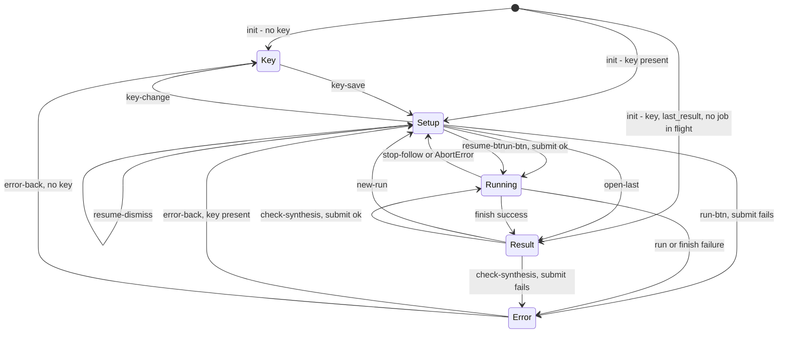

# Motif for Figma — the plugin's flow

*Derived from `surfaces/figma/src/ui.ts` and `surfaces/figma/src/code.ts` as they stand
2026-09-08 (post-restyle, post the two Figma-hand-check fixes), not from memory of using
the plugin. Every transition below cites the handler or function that causes it. Opened
per `docs/specs/stage5-flow-redesign.md`; the flaw list at the end feeds that redesign.
This document describes what exists. It does not fix anything.*

## The five screens

`ui.ts` has one `Screen` union — `"key" | "setup" | "running" | "result" | "error"` — and
one function, `show(s)`, that hides every `#screen-*` section except `s` (`ui.ts:100`).
Only one screen is ever visible.

## State: what persists, what doesn't

Three keys live in `figma.clientStorage` (`code.ts:37-39`), read and written only by the
main thread on request from the UI (`get-key`/`save-key`/`clear-key`,
`set-last-job`/`get-last-result` etc., `code.ts:52-93`). Outside Figma (the harness), the
UI emulates the same three keys directly in `localStorage` (`ui.ts:44-71`) — same shape,
same names, no main thread involved.

| Storage key | Holds | Written by | Cleared by |
|---|---|---|---|
| `anthropic_key` | the API key, masked in the UI as `…last4` | `key-save` | `key-change` |
| `last_job` | `{jobId, question, kind}` for a job still in flight | `submitRun` the instant a job is accepted (`ui.ts:257`) | `finish()`, unconditionally, the instant a job ends in *any* state (`ui.ts:333-334`); or `resume-dismiss` ("Forget it") |
| `last_result` | the full `Stored` object — `{kind, question, nTranscripts, result, layout, jobId, when}` | `finish()`, on every successful run, synthesis or critique alike (`ui.ts:346`) | never explicitly cleared; only overwritten by the next successful run |

Everything else is a module-level variable in the UI iframe and is gone the moment the
plugin window closes, with no persistence at all:

- `files: Prepared[]` — the setup form's transcript list.
- `mode: Mode` — which of the two setup-form jobs is selected.
- `current: Stored | null` — the result screen's own copy of what's on screen.
- `resultUploads: Upload[]` — the transcripts behind the *synthesis* result on screen,
  kept only so "Check this synthesis" can run without asking the user to re-add them
  (`ui.ts:95-98`). Set only inside `finish()`, and only when the job that just finished
  was a **fresh synthesis submitted this session** (`kind === "synthesize" && uploads`,
  `ui.ts:344`) — see Trap 6 below for what that excludes.
- `lastJob`, `follow`, `timer` — the UI's own working copies of the job-in-flight state,
  the current SSE abort handle, and the elapsed-time interval.

So on a plugin reopen: the key, the fact that a job is running, and the last finished
result all survive. The transcripts a user dropped, whatever they typed, which mode they
were in, and the in-memory transcript bytes behind a synthesis do not.

## Transitions

Every arrow below is a real code path; the handler or function name is the trigger.

**App start** (`ui-ready` → the `init` reply, `ui.ts:574-587`)
- No `anthropic_key` → **Key**, and the key input is focused.
- A key exists → **Setup**. `refreshRunBanner(true)` shows "A run is still going from
  last time" if `last_job` is set.
- A key exists, `last_result` exists, **no** `last_job`, and the URL has no `?files=`
  (harness-only escape hatch) → the setup screen is shown only for an instant: the last
  result is fetched and `renderResult` immediately moves to **Result**. A job in flight
  always wins over a stored result — following it is "the more urgent offer" (comment,
  `ui.ts:584`).

**Key screen**
- `key-save` click, or Enter in the key field once it's ≥20 characters
  (`keyInput.oninput`, `ui.ts:140-141`) → posts `save-key` → main thread stores the key
  → the `"key"` reply's listener calls `show("setup")` **only if the key screen is the
  one currently showing** (`ui.ts:591`) — i.e., changing the key from the error screen's
  "Back" path (see below) would not auto-navigate; in practice `error-back` always routes
  through `setup`/`key` first, so this guard is never live in the current flow.

**Setup screen**
- `key-change` ("change", next to the masked key) → posts `clear-key` → `show("key")`
  immediately, key input focused. `files`, `mode`, `question`, and the pasted document
  text are **not** cleared — re-entering a key returns to the same form, filled in
  (`ui.ts:143`).
- `mode-synth` / `mode-critique` → `setMode()` (`ui.ts:201-212`): toggles the tab, shows
  or hides `#document-card`, relabels the question field and the run button, rewrites the
  cost/time line under it, and calls `updateRun()`. No screen change, no state clear —
  files added under one mode stay listed under the other (Trap 1).
- Dropping or choosing files → `addFiles` → `prepare` (per file) → `renderFiles` →
  `updateRun()` (`ui.ts:172-199`). Session-only; nothing is sent anywhere yet.
- A file row's `×` → splices `files`, re-renders (`ui.ts:189`).
- `run-btn` → **Running** (success) or stays on **Setup**, disabled, with a reason
  (failure before submit) or → **Error** (submit rejected). `runBtn.onclick`
  (`ui.ts:263-270`) disables the button, then `submitRun(mode, uploads, question,
  documentText)` (`ui.ts:246-261`):
  1. asks the main thread for the key; no key → `show("key")`, returns `false` (button
     re-enabled) — a defensive path, since the setup screen shouldn't be reachable
     without a key in the first place.
  2. calls `submitSynthesis`/`submitCritique`; on failure, `fail(message)` →
     **Error**, returns `false` (button re-enabled, still on the (now hidden) setup
     screen underneath).
  3. on success: posts `set-last-job` (persists `last_job`), sets in-memory `lastJob`,
     calls `run(jobId, ...)` → **Running**. **This silently overwrites whatever
     `last_job` held before** — see Trap 2.
- `resume-btn` ("Follow it") → **Running**. Calls `run(lastJob.jobId, lastJob.question ??
  "", null, 0)` (`ui.ts:272`) — note the hardcoded `nTranscripts = 0` and no `uploads`
  argument at all. See Trap 6.
- `resume-dismiss` ("Forget it") → stays on **Setup**. Clears in-memory `lastJob`, posts
  `set-last-job` with `jobId: null` (clears persisted `last_job`), calls
  `refreshRunBanner()` to hide the resume card (`ui.ts:273`). The backend job, if still
  running, is never told to stop — this only stops the plugin from tracking it. Unlike
  Trap 2, this is an explicit, named action ("Forget it").
- `open-last` ("Open it") → **Result** if a `last_result` payload exists; otherwise hides
  `#last-card` and stays on **Setup** (`ui.ts:274-278`) — a defensive path, since the card
  that shows this button is itself gated on a payload having existed at init time (see
  Trap 4 for when that gating goes stale).

**Running screen**
- Entered only through `run()` (`ui.ts:301-329`), which is called from three places:
  `submitRun` (a job just submitted), `resume-btn` (a job being re-followed), and nowhere
  else. `run()` first calls `getJob(jobId)`; if that itself fails, → **Error**
  immediately, with a distinct message for an expired job (HTTP 404: "results are kept
  for an hour after they finish", `ui.ts:312-313`) versus any other failure. If the job
  turns out to already be `done`/`failed` (a resumed job that finished while the plugin
  was closed), it skips straight to `finish()` without ever showing a live log.
- `stop-follow` ("Stop watching — run keeps going") → **Setup**. Aborts the SSE follow
  and the elapsed timer, `show("setup")` (`ui.ts:354`). `last_job` is **not** touched —
  the resume card reappears on the setup screen because the job is still genuinely
  running server-side.
- The same abort, reached instead through `followJob` rejecting with `AbortError` inside
  `run()` itself (`ui.ts:324`) → **Setup**, identically.
- `followJob` resolves (the SSE stream ends) → `finish(state, error, ...)`
  (`ui.ts:331-352`). `finish()` **always** clears `last_job` first, regardless of
  outcome — a job that ended, successfully or not, is no longer "in flight" by
  definition. Then:
  - `state !== "done"` → `fail(error || …)` → **Error**.
  - `state === "done"` but `getJob(jobId)` now fails, or the result has no insights at
    all → `fail(...)` → **Error** ("Silence is never a result", `ui.ts:340`).
  - Otherwise → `last_result` is persisted, `resultUploads` is set (synthesis + fresh
    uploads only), `renderResult(stored)` → **Result**. If the board layout fetch
    (`getBoard`) fails at this point, it's only logged to the (about-to-be-abandoned)
    running-screen log — **Result** is still reached, just with `layout: null` and
    `#build-board` permanently disabled for that stored result. See Trap 5.

**Result screen**
- `build-board` → same screen. Posts `build-board` to the main thread; on success
  relabels itself "Build board again"; on failure shows the message inline in
  `#board-status`. Disabled whenever `s.layout` is null.
- `copy-report` → same screen. Builds the report as Markdown (`verdictMarkdown()` for a
  critique, `result.report_markdown` — the engine's own — for a synthesis), tries
  `navigator.clipboard.writeText`, falls back to a visible, pre-selected `#clip` textarea
  with `document.execCommand("copy")`, and if even that fails, leaves the textarea
  visible with a "select and press Cmd/Ctrl+C" note. No state change.
- `check-synthesis` ("Check this synthesis", **only rendered for a synthesis result** —
  `cs.hidden = isVerdict(r)`, `ui.ts:410` — and disabled whenever `resultUploads` is
  empty) → **Running** (success) or **Error** (failure). Reuses `resultUploads` and the
  current result's own `report_markdown` as the document to critique
  (`ui.ts:561-567`), going through the same `submitRun` path as the form's run button.
- `new-run` ("Start another") → **Setup**, unconditionally (`ui.ts:569`). `current` is
  **not** cleared, and neither is the setup form underneath — the files, question, and
  mode from before this run are still there. See Trap 3 for what "Start another"
  actually loses.

**Error screen**
- `error-back` ("Back") → **Setup** if a key exists, else **Key** (`ui.ts:570`). Nothing
  about *what* was being attempted is restored or retried automatically; whatever state
  the setup form held before the failed attempt is still there (from Trap-3-style
  persistence-by-omission), but the result screen that led here (if any) is not — see
  Trap 3.

## Controls per screen

| Screen | Control | Enabled / visible when |
|---|---|---|
| Key | `#key-input` | always |
| | `#key-save` | trimmed input ≥ 20 chars |
| | "Get a key" link | always (external) |
| Setup | `#resume-card` | `lastJob` is set |
| | `#resume-btn` / `#resume-dismiss` | always, when the card is shown |
| | `#last-card` / `#open-last` | `hasLastResult` **at init only** — see Trap 4 |
| | `#editor-note` | `editor === "figma"` (Figma Design, not FigJam) |
| | `#mode-synth` / `#mode-critique` | always |
| | `#drop`, `#file-input` | always |
| | `#document-card` | `mode === "critique"` |
| | `#run-btn` | critique: files present and pasted text > 20 chars; synthesize: files present and a question is typed. Label reads "Synthesize" or "Check the synthesis" |
| | `#run-why` | shown, with a reason, exactly when `#run-btn` is disabled |
| Running | `#stop-follow` | always |
| Result | `#build-board` | `s.layout` is not null |
| | `#copy-report` | always |
| | `#check-synthesis` | **hidden** for a critique result; for a synthesis result, disabled unless `resultUploads.length` (this session's own fresh synthesis) |
| | `#new-run` | always |
| | `#critic-notes` | critique result only, and only if there are notes to show |
| | `#clip` / `#clip-note` | only after a clipboard-write failure during `copy-report` |
| Error | `#error-hint` | message matches a known pattern (auth / billing / network) |
| | `#error-back` | always |

## State diagram

---

## Dead ends and traps

Five are the root causes already named in `docs/specs/stage5-flow-redesign.md`; they're
restated here in one line each, confirmed against the code above, for a single list. The
rest were found writing the transitions above and confirmed by reading the handler, not
by using the plugin.

1. **One form, two jobs, no reset.** `setMode()` (`ui.ts:201`) changes what "1.
   Transcripts" means, what the run button says and does, and what the question field is
   for — but never clears `files` or the pasted document. A file list built for one mode
   silently carries into the other. *(stage5, root cause 1.)*
2. **Four peer actions, no default.** `build-board`, `copy-report`, `check-synthesis`,
   `new-run` sit in one row with no visual or textual hint of a normal next step; all
   four are always full-strength calls to action. *(stage5, root cause 2.)*
3. **No screen ever shows where you are in the process.** Five screens, no step
   indicator, no breadcrumb — confirmed: nothing in `ui.html`'s markup or `ui.ts`'s
   `show()` renders position or progress toward "a board on the page." *(stage5, root
   cause 3.)*
4. **`last_result` is one slot.** `finish()` persists to it on *every* successful run,
   synthesis or critique alike (`ui.ts:346`), with no history and no undo. Checking a
   synthesis destroys the ability to reopen that synthesis later — there is no code path
   that reads two results at once. *(stage5, root cause 4.)*
5. **"Check this synthesis" is memory-only.** `resultUploads` is a plain module variable,
   never persisted (`ui.ts:98`); it exists purely to avoid the copy-paste round trip, and
   is empty again the moment the plugin reopens — the button stays visible but disabled,
   with a title attribute explaining why. *(stage5, root cause 5.)*
6. **`last-card`'s visibility is set once, at init, and never again.** `$("last-card")
   .hidden = !m.hasLastResult` runs only inside the `init` listener (`ui.ts:578`); nothing
   else ever touches it. Start the plugin with no stored result, finish a run this
   session, click "Start another" — `last_result` is now genuinely populated (`finish()`
   persisted it), but `#last-card` is still `hidden` from the stale init read, so there is
   no visible way back to the result just produced without closing and reopening the
   plugin (which re-runs `init` with `hasLastResult: true`). The only other path back
   is `#check-synthesis`, and only if the result was a synthesis and the plugin was never
   reopened since (Trap 5).
7. **Resuming a job loses the fresh-transcripts memory.** `resume-btn`'s call to `run()`
   passes `nTranscripts = 0` and no `uploads` argument at all (`ui.ts:272`). If the
   resumed job turns out to be a synthesis and finishes successfully, `finish()`'s guard
   `kind === "synthesize" && uploads` (`ui.ts:344`) is false — `uploads` is `undefined` —
   so `resultUploads` is never populated. `#check-synthesis` renders visible but
   permanently disabled for that result, with the same "session no longer has the
   transcripts" title used for an actually-reopened plugin, even though the run just
   finished in this very session. A second, smaller effect of the same missing
   `nTranscripts`: `confidenceBadge()` (`ui.ts:428`) reads the "N sources" wording instead
   of "N of `nTranscripts`", since `nTranscripts` is falsy.
8. **Submitting a new run silently orphans the old one.** `run-btn`'s handler never
   checks `lastJob` before calling `submitRun` (`ui.ts:263`), and the button is never
   disabled because a job is already in flight — only because the *form* is incomplete.
   `submitRun`'s `set-last-job` post (`ui.ts:257`) unconditionally overwrites whatever
   `last_job` held. The previous job, if still running on the engine, is now unreachable
   from the plugin forever: no id anywhere in storage can follow or reference it again.
   Unlike `resume-dismiss` ("Forget it"), this happens with no label, no confirmation, and
   no indication it happened at all — the resume card can be sitting right there, visible,
   while the user fills in and submits a brand-new run underneath it.
9. **A failed board-layout fetch has no retry.** If `getBoard(jobId)` throws inside
   `finish()` (`ui.ts:342`), the failure is only ever written to `appendLog` on the
   running screen — a screen the user is about to leave, permanently, the instant
   `renderResult` shows **Result**. `#build-board` is disabled
   (`bb.disabled = !s.layout`) with no code path that re-fetches the layout later; the
   only way to get a board for that run is to redo the entire synthesis or critique from
   scratch.
10. **A failed "Check this synthesis" strands the user away from the synthesis it was
    checking.** `check-synthesis`'s failure path calls `fail()` → **Error**
    (`ui.ts:561-567` via `submitRun`); `error-back` from there goes to **Setup**
    (`ui.ts:570`), not back to **Result**. `current` still holds the synthesis in memory
    — nothing clears it — but there is no code path that redisplays it: `#last-card` is
    stale (Trap 6) or, worse, was never shown this session at all if this was a
    freshly-produced synthesis. The only way back is reopening the plugin, which reloads
    `last_result` from storage — but that now depends on whether `finish()` for the
    *original* synthesis run had already persisted it (`ui.ts:346`, which it always has,
    by the time a result screen with a `check-synthesis` button could exist) — so reopening
    does recover the synthesis, closing the trap only via a step (quit and reopen) the UI
    never suggests.

### Editor difference: FigJam has no dark theme

Figma Design supports light and dark; FigJam does not — a FigJam board is always light.
The `figma-dark` class the whole restyle's dark palette depends on
(`docs/specs/plugin-restyle.md` §2) is therefore only ever added when the plugin is
running in a Figma Design file. In FigJam, the panel is light regardless of the user's OS
or Figma appearance setting; `#editor-note` (shown for Figma Design,
`editor === "figma"`, `ui.ts:579`) is the only place editor identity reaches the UI at all
today, and it says nothing about theme.
